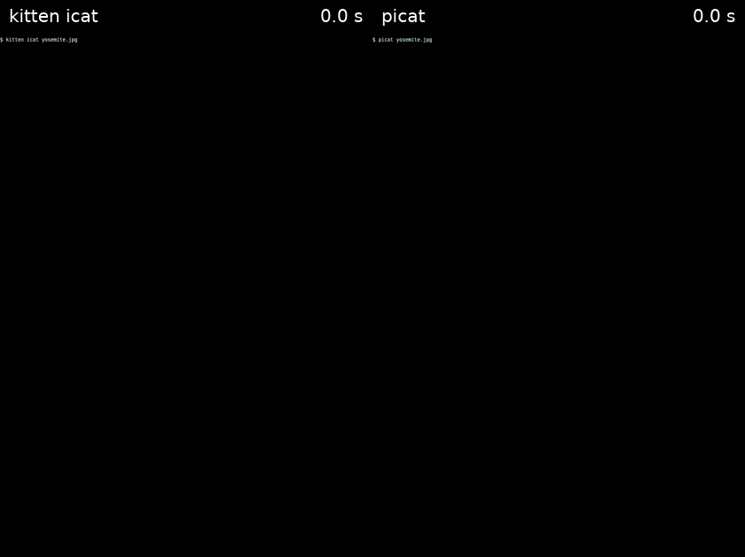

# picat

Shows an image in the [kitty](https://sw.kovidgoyal.net/kitty/) terminal quickly over a slow
connection, such as ssh. A tiny preview (1/16 of the width) appears almost at once, then sharper
ones (1/4 and 1/2 of the width), all stretched to the final size. The full-resolution image then
arrives in horizontal strips, each covering the preview where it lands. The image is scaled to fit
the terminal window, so no more pixels are sent than can be shown.



picat shows a blurry preview after 0.2 s and a sharp image by 0.8 s; `kitten icat` shows nothing
until the whole image arrives at 4.1 s. Both ran in kitty 0.32.2 windows of 1000×1400 pixels, with
their output passed to kitty at 10 Mbit/s, and picat had already measured the link's rate. The
photo, of Yosemite National Park, is by
[Vulturesong](https://commons.wikimedia.org/wiki/File:Yosemite_National_Park_-_HCP_-_October_07,_2022_-_012.jpg)
and in the public domain (CC0).

```sh
uv tool install -e .     # installs the `picat` command
picat image.png
some-command | picat -
picat --progress image.png
```

The prompt comes back as soon as the first preview is on screen, and the rest of the image loads
in the background while you carry on typing. Everything goes to kitty over the one connection, so
if the image data were sent as fast as possible, your typing would be echoed only after it. picat
therefore sends the rest at 90% of the link's rate, which it measures from how long kitty takes to
acknowledge the first two previews, and reuses for 10 minutes on the same ssh connection. The first
run in that time waits for those acknowledgements, about half a second on a 10 Mbit/s link, and
anything typed during that wait is lost. If you run another command before the image has finished,
loading stops, and the image stays at whichever stage it had reached.

`--progress` instead loads everything before returning the prompt, with a bar below the image
showing the time left. Setting `PICAT_LOG` to a file name logs the measured rate and how each
background load ended.

It works inside tmux, using kitty's Unicode placeholders (text cells that tmux treats as ordinary
characters and kitty draws the image over), provided tmux has `set -g allow-passthrough on`. It
needs kitty 0.31 or later, which can place an image relative to such placeholders, so that later
stages scroll along with the first preview.

## Compared with `kitten icat`

Both programs ran in a 2000×1416-pixel terminal, with their output read at 10 Mbit/s, on a photo
and on a generated image (a 3×2 grid of 1024×1024 images), each at three sizes. Images wider than
2000 pixels are shrunk to 2000×1283 (photo) or 2000×1333 (generated) by both. picat already knew
the link's rate, so it returned the prompt without waiting for acknowledgements. Times are the
median of 3 runs, which differed by at most 0.05 s.

| Image | Full image, icat | First pixels, picat | Prompt back, picat | Full image, picat | Sent, icat | Sent, picat |
|---|---|---|---|---|---|---|
| Photo 1562×1002 | 0.51 s | 0.04 s | 0.09 s | 0.62 s | 0.54 MB | 0.67 MB |
| Photo 3125×2005 | 0.97 s | 0.07 s | 0.14 s | 1.14 s | 0.96 MB | 1.22 MB |
| Photo 6250×4010 | 1.17 s | 0.15 s | 0.23 s | 1.38 s | 1.05 MB | 1.38 MB |
| Generated 768×512 | 0.89 s | 0.05 s | 0.05 s | 1.10 s | 1.06 MB | 1.21 MB |
| Generated 1536×1024 | 3.23 s | 0.08 s | 0.12 s | 3.91 s | 3.86 MB | 4.34 MB |
| Generated 3072×2048 | 8.04 s | 0.18 s | 0.25 s | 6.41 s | 9.30 MB | 7.03 MB |

icat draws nothing until all the data has arrived, and returns the prompt then. With picat the
whole image usually arrives 0.1–0.7 s later than with icat, because its three previews add roughly
15–50% to the data sent, and the rest is sent at 90% of the link's rate. It arrives sooner only for
the largest generated image, which both programs must shrink to fit the window. There icat sends
raw pixels compressed with zlib, while picat sends PNG, which first predicts each pixel from its
neighbours and compresses only the difference; on a smooth generated image that makes the data
about a quarter smaller. On the photo the prediction does not help, and zlib on raw pixels comes
out about 10% smaller than PNG. When an image is a PNG that already fits, icat sends the file
unchanged.
