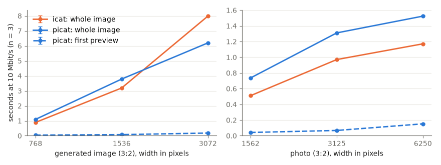

# picat

Shows an image in the [kitty](https://sw.kovidgoyal.net/kitty/) terminal quickly over a slow
connection, such as ssh. A tiny preview (1/16 of the width) appears almost at once, then sharper
ones (1/4 and 1/2 of the width), all stretched to the final size. The full-resolution image then arrives in
horizontal strips, each replacing the preview where it lands, while a bar below shows the time
left. The image is scaled to fit the terminal window, so no more pixels are sent than can be shown.

```sh
uv tool install -e .     # installs the `picat` command
picat image.png
some-command | picat -
```

It works inside tmux, using kitty's Unicode placeholders (text cells that tmux treats as ordinary
characters and kitty draws the image over), provided tmux has `set -g allow-passthrough on`.

## Compared with `kitten icat`



Both programs ran in a 2000×1416-pixel terminal, with their output read at 10 Mbit/s, on a
generated image (a 3×2 grid of 1024×1024 images) and on a photo, each at three sizes. The spread
over 3 runs is under 0.02 s, too small to see. picat shows a preview within 0.2 s at every size;
icat shows nothing until the whole image has arrived.

The whole image usually arrives 0.2–0.6 s later with picat, because its three previews add
13–50% to the data sent. It arrives sooner only for the largest generated image, which both
programs must shrink to fit the window. There icat sends raw pixels compressed with zlib, while
picat sends PNG, which first predicts each pixel from its neighbours and compresses only the
difference; on a smooth generated image that makes the data about a third smaller. On the photo the
prediction does not help, and zlib on raw pixels comes out about 10% smaller than PNG. When an
image is a PNG that already fits, icat sends the file unchanged.
